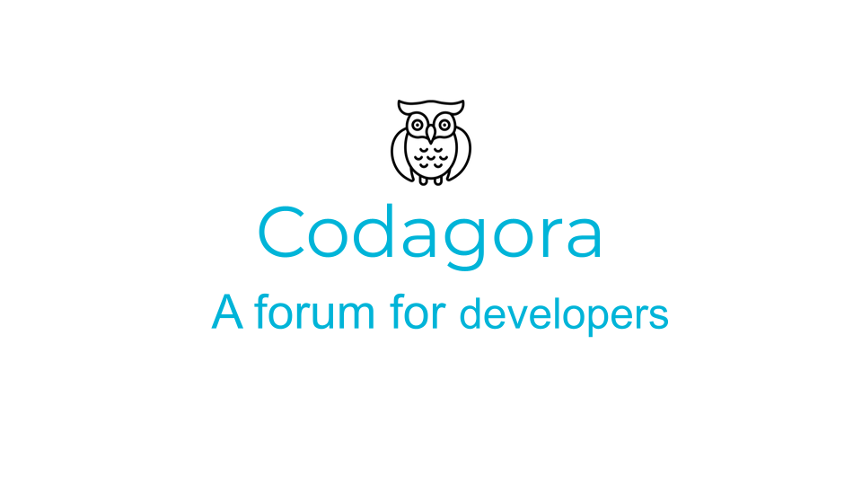
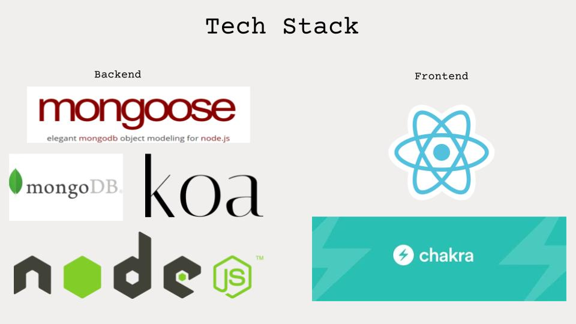

  
  

### Codagora

A forum where developers can discuss the latest technologies, collaborate on projects and connect with other fellow developers.

### Getting started
- Fork this repo and clone it on your local machine
- Intall the dependencies by running `npm i` from the client and server folder
- Run the server with `npm start`
- Now you can kick off the React development with `npm start`
- You should be good to go! Have fun!

  
  

### Tech Stack

  
  

